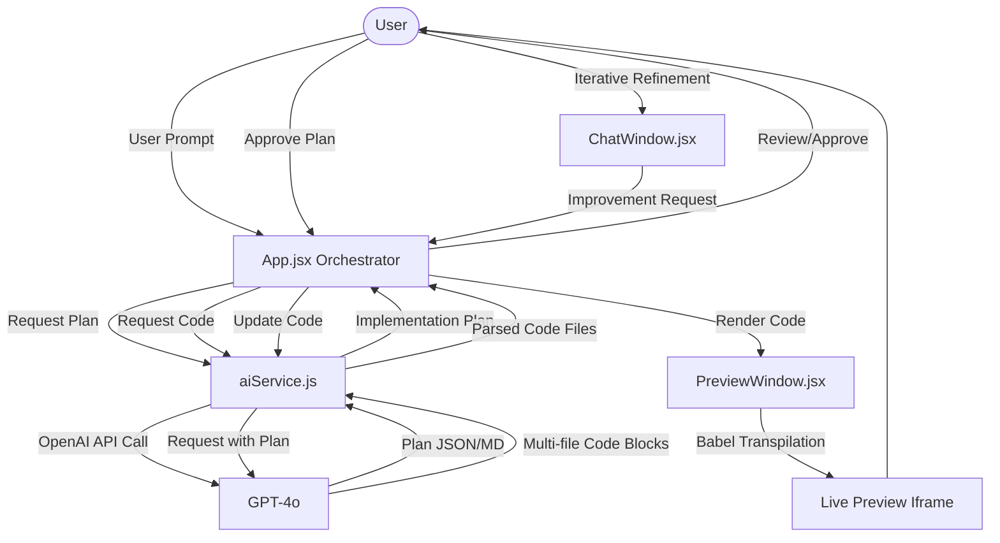

# System Architecture - Agent App Builder

This document provides a technical overview of the Agent App Builder architecture, detailing how it transforms natural language prompts into live, interactive React applications.

## High-Level Architecture

The system follows a state-machine driven workflow, orchestrating interactions between the user, the AI service, and a dynamic preview environment.

## Core Components

### 1. Orchestrator (`App.jsx`)
The central state machine managing the application lifecycle. It transitions through the following states:
- `PROMPT`: Initial user input.
- `GENERATING_PLAN` / `PLAN_REVIEW`: AI creates a structural plan for user approval.
- `GENERATING_CODE` / `CODE_REVIEW`: AI generates the full React application code.
- `PREVIEW`: Renders the generated code in a sandbox.
- `CHAT`: Allows for iterative improvements via a chat interface.

### 2. AI Service (`services/aiService.js`)
A singleton service that interfaces with the OpenAI API.
- **`generateImplementationPlan`**: Requests a high-level roadmap.
- **`generateCode`**: Requests full multi-file React code based on the plan.
- **`improveCode`**: Handles iterative updates to existing code.
- **`parseReactCodeBlocks`**: Extracts multiple files (JSX/CSS) from AI markdown responses.

### 3. Preview Window (`components/PreviewWindow.jsx`)
A sophisticated sandbox for running generated code.
- **Transpilation**: Uses `Babel Standalone` to compile JSX in the browser.
- **Sandboxing**: Renders the application inside an `iframe` with `srcDoc`.
- **Global Context**: Injects React and hooks into the global scope so the AI doesn't need to write import statements.
- **Exporting**: Uses `JSZip` to package the generated project into a downloadable boilerplate.

### 4. Chat Window (`components/ChatWindow.jsx`)
Facilitates the "Agentic" loop, allowing users to converse with the AI to refine the generated application without losing context of previous iterations.

## Data Flow

1. **Input**: User submits a natural language description (e.g., "Create a dark-themed weather app").
2. **Planning**: AIService asks GPT-4o for a plan. The user reviews features and structure.
3. **Generation**: GPT-4o generates `App.jsx`, `App.css`, and relevant sub-components.
4. **Processing**: `PreviewWindow` strips imports/exports, combines CSS, and wraps code in a Babel-powered HTML template.
5. **Execution**: The `iframe` loads, Babel transpiles the JSX on-the-fly, and `ReactDOM.render` mounts the app.
6. **Refinement**: User provides feedback (e.g., "Add a 5-day forecast"), triggering a targeted code update.

## Technology Stack

- **Frontend**: React 18, Vite.
- **AI**: OpenAI GPT-4o.
- **Code Processing**: Babel Standalone (v7), JSZip.
- **Styling**: Vanilla CSS with modern aesthetics (Flexbox, Grid, Animations).
